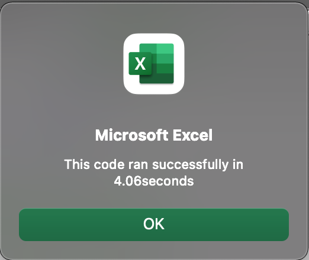
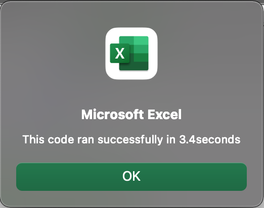

# Stock-analysis
 Refactoring the stocks data analysis code to compare yearly return percentage and formatting the results with VBA.

# Overview of Project
This project is an assignmnet from Data Analytics program - VBA Module 
- Deliverable 1:  Refactor VBA code and measure performance 
  This deliverable will include an updated workbook and a folder with PNGs of the pop-ups with script run time  
   

# Results
Original Code 

Refactored Code 

# Summary
Advantages or disadvantages of refactoring code 
The advantage of refactoring is to boost up system performance, as it can made the script run efficiently,  
using less memory and more simplify code for future users. 
The downside of refactoring is it takes time to restructure the system which might causes error when messing the exsiting data format. 

Pros and cons apply to refactoring the original VBA script

